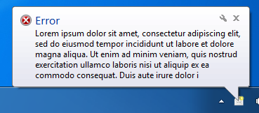
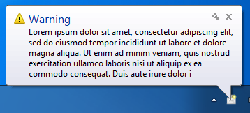

# two-slices
Simple library for desktop notifications from Java on Windows, Mac OS X and Linux.
 
 * One-line of code to show a notification for most cases
 * Tries to find the best implementation available to give the best looking and most integrated experience.
 * No hard dependencies, although can be augmented with SWT to provide further options.
 * Supports NONE, INFO, ERROR and WARNING notifications types, each with it's own icon.
 * Supports custom icons
 * Can integrate with your existing system tray icon if required (SWT and Swing/AWT)

## All Platforms

All platforms support Growls GNTP protocol. If you have have Growl for Mac OS X, Linux or Windows installed, running on listening on the default port, it will be used in preference to all platform specific notification systems.

Additionally on all platforms, if no notifier implementation can be found, the last resort fallback will be to display the messages on *System.out*.

## Windows

 

Windows support is currently provided in the following order :-

 * JavaFX. If JavaFX and ControlsFX is on the CLASSPATH, [ControlsFX](http://controlsfx.com) based notification popups will be used.
 * SWT. If SWT is on the CLASSPATH, its System Tray support and balloon tooltip will be used.
 * AWT. If no SWT is available, the built-in AWT System Tray support will be used. 

## Mac OS X

  

Mac OS X support will be provided in the following order :-

 * If native notification centre support is available (Mountain Lion and above), it will be used first.
 * Growl (via AppleScript). If Growl via AppleScript is available, it will be used.
 * If there is no growl, but osascript is an available command, the default Notification Centre will be used
 * JavaFX. If JavaFX and ControlsFX is on the CLASSPATH, [ControlsFX](http://controlsfx.com) based notification 
 * SWT. If SWT is on the CLASSPATH, its System Tray support and balloon tooltip will be used.
 * AWT. If no SWT is available, the built-in AWT System Tray support will be used.    
 
## Linux

 

Linux support will be provided in the following order :-

 * If `dbus-java` is available, native DBus notifications will be used.
 * notify-send. If this is an available command, the default desktop notifications will be used
 * JavaFX. If JavaFX and ControlsFX is on the CLASSPATH, [ControlsFX](http://controlsfx.com) based notification 
 * SWT. If SWT is on the CLASSPATH, its System Tray support and balloon tooltip will be used.
 * AWT. If no SWT is available, the built-in AWT System Tray support will be used.

## Configuring your project

The library is available in Maven Central, so configure your project according to the
build system you use. For example, for Maven itself :-

*Note, currently only available on Snapshots repository so you'll need to add that first until full release*

```xml

..

	<repositories>
		<repository>
			<id>oss-snapshots</id>
			<url>https://oss.sonatype.org/content/repositories/snapshots</url>
			<snapshots>
				<enabled>true</enabled>
			</snapshots>
			<releases>
				<enabled>false</enabled>
			</releases>
		</repository>
	</repositories>
	
..


	<dependencies>
		<dependency>
			<groupId>com.sshtools</groupId>
			<artifactId>two-slices</artifactId>
			<version>0.0.2-SNAPSHOT</version>
		</dependency>
	</dependencies>
```

## Showing A Message

For the simplest use, call Toast.toast() :-

```java
Toast.toast(ToastType.INFO, "Information", "Here is some information you cannot do without.");
```

### With A Custom Icon

You can pass in the full path to an icon too (requires support for this in selected platform)

```java
Toast.toast(ToastType.INFO, "/usr/share/pixmaps/mypic.png", "Boo!", "See my image?");
```

## Using The Builder

An alternative way to build more complex messages is using `ToastBuilder`. 

```java
var builder = Toast.builder();
builder.title("My Title");
builder.content("Some content");

builder.toast();
```

### Closing

You can prematurely close messages if the toaster implementation supports it.

```java
var builder = Toast.builder();
builder.title("My Title");
builder.content("Some content");
var slice = builder.toast();

// ...

slice.close();

```

If you want to be notified when a message is closed, e.g. dismissed by the user. Set a listener on the builder.

```java
var builder = Toast.builder();
builder.content("Some content");
builder.closed(() -> {
    System.out.println("Message closed.");
});
builder.toast();

```

## Settings

Some settings may be provided to alter the behaviour of the toasters. These are only hints, and specific 
toasters can ignore any and all of them.  

```java
ToasterFactory.setSettings(new ToasterSettings().setAppName("My App Name"));
```

### The Tray Icon Mode

Some implementations will require and/or show an icon in your system tray. This will be where the notification
messages are anchored too. You can set a hint as to how to treat this icon via the configuration.

```java
ToasterSettings settings = new ToasterSettings();
settings.setAppName("My App Name");
settings.setSystemTrayIconMode(SystemTrayIconMode.HIDDEN);
ToasterFactory.setSettings(settings);
```

The options for system tray icon mode are :-
 * HIDDEN. The icon will be hidden at all times. This may require the use of a transparent image depending on the platform.
 * SHOW_TOAST_TYPE_WHEN_ACTIVE. When active, the icon in the system tray will reflect the type of the current message that is being displayed.
 * SHOW_DEFAULT_WHEN_ACTIVE. When a message is shown, the default tray icon will be show (see `ToasterSettings.setDefaultImage()`).
 * SHW_DEFAULT_ALWAYS. The default image (see above) will always be visible as soon as the first notification message is sent.

*When you are providing a 'parent' tray item, the icon mode above may be ignored.*

### SWT

If you have an SWT application that already has an icon on the tray, you can re-use this for your notification
settings when the SWT notifier is used.

*For SWT, you must already be running an event loop (see SWT toolkit documentation). At the moment it is not possible to automatically start a loop mainly due to restrictions on OS X where SWT must be on the main thread.*

```java
TrayItem myTrayItem = .....  // this is the reference to your org.eclipse.swt.widgets.TrayItem
ToasterFactory.setSettings(new ToasterSettings().setParent(myTrayItem));
```

Then, whenever the SWT notifier is used, the balloon message will be anchored to your tray item.

### AWT

If you have a Swing/AWT application that already has an icon on the tray, you can re-use this for your notification
settings when the AWT notifier is used.

```java
TrayIcon myTrayIcon = .....  // this is the reference to your java.awt.TrayIcon
ToasterFactory.setSettings(new ToasterSettings().setParent(myTrayIcon));
```

Then, whenever the AWT notifier is used, the balloon message will be anchored to your tray item.

## Extending

You can add your own notifier implementations and customise the factory if you have any special requirements.

### Installing Your Own Factory

Simply extend `ToasterFactory`, providing you own `toaster()` method.  This will be registered as the default factory the first time you instantiate it (so make sure you do this before ever asking for toast) :-

```java
new ToasterFactory() {
	@Override
	public Toaster toaster() {
		return new MyToaster(); 
	}
};
```

There is a Default implementation of a Toaster Factory you might consider, `ToasterFactory.DefaultToasterFactory`. For example to add support for another platform (if you actually do this please consider contributing to this project!) :-

```java
new ToasterFactory.DefaultToasterFactory() {
	@Override
	public Toaster toaster() {
		if(System.getProperty("os.name").equals("SomeOtherPlatform"))
			return new MyToaster();
		else
			return super.toaster(); 
	}
};
```


### Implementing a Toaster

Implement the `Toaster` interface. An abstract implementation `AbstractToaster` is provided for your convenience and should be used where possible. By convention, all Toasters take a `ToasterSettings` in their constructor. 

In the constructor of your implementation, you should test if this implementation is for the current enviroment. E.g. if you were writing an OS X specific notifier, then you would test for running on that platform and the availability of any libraries or external tools you might need. By convention, if the environment is not sufficient, an `UnsupportedOperationException` should be thrown.

### Your Custom Toast

Just call `Toast.toast` as you normally would.
