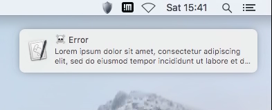
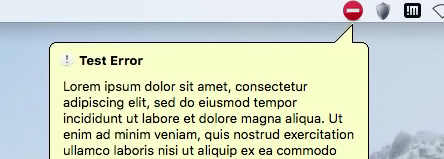
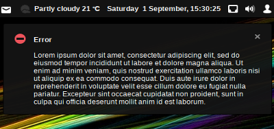
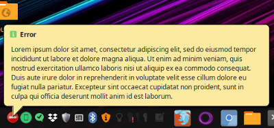

# two-slices
Simple library for desktop notifications from Java on Windows, Mac OS X and Linux.

## Windows

Windows support is currently provided in the following order :-

 * SWT. If SWT is on the CLASSPATH, its System Tray support and balloon tooltip will be used.
 * AWT. If no SWT is available, the built-in AWT System Tray support will be used. 

## Mac OS X

  

Mac OS X support will be provided in the following order :-

 * Growl. If Growl is available, it will be used.
 * If there is no growl, but osascript is an available command, the default Notification Centre will be used
 * SWT. If SWT is on the CLASSPATH, its System Tray support and balloon tooltip will be used.
 * AWT. If no SWT is available, the built-in AWT System Tray support will be used.    
 
## Linux

 

Linux support will be provided in the following order :-

 * notify-send. If this is an available command, the default desktop notifications will be used
 * SWT. If SWT is on the CLASSPATH, its System Tray support and balloon tooltip will be used.
 * AWT. If no SWT is available, the built-in AWT System Tray support will be used.

## Configuring your project

The library is available in Maven Central, so configure your project according to the
build system you use. For example, for Maven itself :-

* Note, currently only available on Snapshots repository so you'll need to add that first 
  until full release*

```xml

..

	<repositories>
		<repository>
			<id>oss-snapshots</id>
			<url>https://oss.sonatype.org/content/repositories/snapshots</url>
			<snapshots>
				<enabled>true</enabled>
			</snapshots>
			<releases>
				<enabled>false</enabled>
			</releases>
		</repository>
	</repositories>
	
..


	<dependencies>
		<dependency>
			<groupId>com.sshtools</groupId>
			<artifactId>two-slices</artifactId>
			<version>0.0.1-SNAPSHOT</version>
		</dependency>
	</dependencies>
```

## Showing A Message

For the simplest use, call Toast.toast() :-

```java
Toast.toast(ToastType.INFO, "Information", "Here is some information you cannot do without.");
```

## Settings

Some settings may be provided to alter the behaviour of the toasters. These are only hints, and specific 
toasters can ignore any and all of them.  

```java
ToasterFactory.setConfiguration(new ToasterSettings().setAppName("My App Name"));
```

### SWT

If you have an SWT application that already has an icon on the tray, you can re-use this for your notification
settings when the SWT notifier is used.  

```java
TrayItem myTrayItem = .....  // this is the reference to your tray item
ToasterFactory.setConfiguration(new ToasterSettings().setParent(myTrayItem));
```

Then, whenever the SWT notifier is used, the balloon message will be anchored to your tray item.